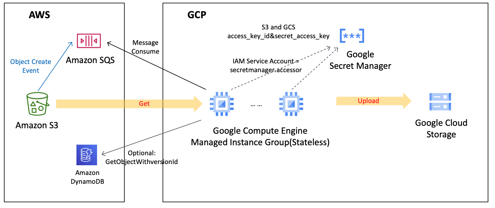

# AWS S3 to GCS (Google Storage) 近实时增量数据同步

  架构图如下：  
  Amazon S3 新增文件触发传输：
  
  
## 工作原理  
0. 存量数据列表（可选）：Jobsender 获取源和目的 Bucket List并比对差异，发送 Job messages 到 SQS。  

1. Amazon S3 新增文件 Object Create Event 直接触发Amazon SQS，每个Object是一个Job。  

2. Amazon EC2 从SQS获取Job。每个EC2 instance多线程获取多个Job。  对每个Job创建多线程，每个线程各自获取文件分片，并上传到目标 GCS  

3. 传输完成，则自动删除SQS中这个Job消息；如果传输过程中断，则Job消息不会被删除，然后在超时过时后，该消息会重新出现并被另一个EC2或进程获取，并进行重传。小文件重传会直接重新开始下载，这样效率高；大文件重传会先查询目标桶中该文件是否存在，存在则进行续传；大小文件的分界标准可以设定（ResumableThreshold 目前设置为50MB）；  

4. 迁移集群建议部署在源S3相同Region，并启用 VPC S3 Endpoint(GW)，这样不走公网。  

5. 两个云之间的网络建议走公网，即 S3-> EC2 –Internet–>GCS，这样带宽最高，充分利用 AWS 与 Google 之间的互联网络；如果走专线，需要在GCP设置 VPC Google Private Access ，并设置DNS解析。

### 性能与可控运营  
* 单Worker节点并发多线程从Amazon SQS获取多个文件任务，每个文件任务只会被一个Worker获得。Worker对每个任务并发多线程进行传输，这样对系统流量更可控，稳定性比把一个文件分散多节点要高，也不会出现一个大文件就堵塞全部通道，特别适合大量大文件传输。
* 多机协同，吞吐量叠加，单台服务器吞吐约1Gbps  

### 可靠与安全性  
* 每个分片传输完成都会在GCS上做MD5完整性校验。  
* 多个超时中断与重试保护，保证单个文件的送达及时性：  
Amazon EC2 worker上有任务超时机制，s3_migration_cluster_config.ini 中默认配置1小时  
Amazon SQS 消息设置 Message InvisibleTime 对超时消息进行恢复，驱动节点做断点重传，建议与Worker超时时间一致。如果混合集群和Serverless架构，则以时间长的那方来设置InvisibleTime  
Amazon SQS 配置死信队列DLQ，确保消息被多次重新仍失败进入DLQ做额外保护处理。CDK中默认配置24次。 
* Single point of TRUE：把最终GCS作为分片列表的管理，合并文件时缺失分片则重新传。
* 建议一批次任务在全部任务完成后，运行jobsender进行List比对。或定期运行核对源和目的S3的一致性。
* 文件分片只经worker内存缓存即转发，不去占I/O写本地磁盘（速度&安全）
* 传输为Amazon S3 API / GCS XML API: SSL加密传输
* 开源代码，只使用 AWS SDK 和 Python3 内置的库，无任何其他第三方库。
* 一侧Amazon S3访问采用IAM Role，另一侧GCS访问的access key保存在SSM ParaStore中(KMS加密)，或Lambda的EnvVar(KMS加密)，不在代码或配置文件保存任何密钥  

### 弹性成本  
* Autoscaling Group 自动扩展和关机
* 使用 Spot Instances 降低成本，Worker节点无状态，可承受随时中断
* 可运行 AWS Lambda Serverless 处理不定期，突发任务
* 可根据自己的场景测试寻找最佳性价比：
	调整最低配置Amazon EC2 Type和AWS Lambda Memory Jobs/node * Threads/Jobs * Nodes 组合，包括考虑：数据传送周期、文件大小、批次大小、可容忍延迟、成本。常见是采用 2 cores 2GB memory 即可。  
* 存入目标存储级别可直接设置 IA, Deep Archive 等

## 部署
### 1. 配置密钥
* 配置 System Manager Parameter Store 新增这个参数，用于保存GCS一侧的访问密钥 
名称：s3_migration_credentials  
类型：SecureString  
级别：Standard  
KMS key source：My current account/alias/aws/ssm  或选择其他你已有的加密 KMS Key  
这个 s3_migration_credentials 是用于访问GCS的访问密钥。配置示例：  
```
{
  "aws_access_key_id": "your_aws_access_key_id",
  "aws_secret_access_key": "your_aws_secret_access_key",
  "region": "europe-west3"
}
```
配置示意图：  
 

### 2. 配置一个 DynamoDB 表跟服务器在同一个region: Oregon  
表名，例如：s3_migration_file_list  
主键：Key  
Write/Read Capacity 设置为 OnDemand（按需）  
可选：设置一个TTL，键值为endTime的，这样传输结束之后会被DDB自动清理掉  
 

### 3. 配置一个 sqs 和一个 sqs dlq （死信队列）
名称：s3_migration_file_list  和  s3_migration_file_list_deadletter  
要建在S3所在的region  
SQS Visibility timeout = 1 hour，Message retention period = 14 days  
 

### 4. SQS access policy  
写入SQS权限："Service": "s3.amazonaws.com"  
读取SQS权限：直接填 AWS Account Number  
样例：  
```
{
  "Version": "2008-10-17",
  "Id": "__default_policy_ID",
  "Statement": [
    {
      "Sid": "__owner_statement",
      "Effect": "Allow",
      "Principal": {
        "AWS": "arn:aws:iam::AWS Account Number:root"
      },
      "Action": "SQS:*",
      "Resource": "arn:aws:sqs:us-west-2:AWS Account Number:s3_migration_file_list"
    },
    {
      "Sid": "__sender_statement",
      "Effect": "Allow",
      "Principal": {
        "Service": "s3.amazonaws.com"
      },
      "Action": "SQS:SendMessage",
      "Resource": "arn:aws:sqs:us-west-2:AWS Account Number:s3_migration_file_list"
    },
    {
      "Sid": "__receiver_statement",
      "Effect": "Allow",
      "Principal": {
        "AWS": "arn:aws:iam::AWS Account Number:root"
      },
      "Action": [
        "SQS:ChangeMessageVisibility",
        "SQS:DeleteMessage",
        "SQS:ReceiveMessage"
      ],
      "Resource": "arn:aws:sqs:us-west-2:AWS Account Number:s3_migration_file_list"
    }
  ]
}
```
Optional：建一个SQS 死信队列，用来存储主SQS队列处理多次失败的消息  
建好之后，要指定主SQS的死信队列是这个，以及重试多少次之后会进入死信队列  

4. 设置 s3 bucket trigger SQS  
在存储桶属性里面设置 Event notifications  
如果S3跟SQS不在同一个账号下，则SQS queue这里选择 SQS的ARN  
 

5. 新建IAM role for EC2  
IAM权限：  
* 读取S3: AmazonS3ReadOnlyAccess  
* 读写DynamoDB AmazonDynamoDBFullAccess  
* 读写SQS AmazonSQSFullAccess  
* 读取ssm:GetParameter AmazonSSMReadOnlyAccess  
如果是单独授权S3访问权限，或者是跨账号访问S3，则源S3权限至少要放开这四个权限给 EC2的IAM Role：ListBucket/GetObject/GetObjectVersion/ListBucketVersions  
 

6. 创建和设置 EC2 组  
EC2服务器配置上一步骤创建的IAM Role  
代码下载方式：建议代码放 s3 一个单独的bucket，然后服务器启动的时候，自动从该S3桶自动下载。源代码：https://github.com/hawkey999/s3-to-gcs-migration-cluster/tree/main/cluster/code   
配置 s3_migration_cluster_config.ini 文件：  
* 设置DynamoDB的名称  
* 设置SQS的名称  
* 目标Bucket的桶名和Prefix，Prefix可以为空  
* LoggingLevel = WARNING or INFO  
* 适当调整 MaxThread 和 MaxParallelFile  
* 视忽是否要利用versionId来保证文件完整性，见下节的说明来配置 GetObjectWithVersionId  
然后运行文件 python3 s3_migration_cluster_worker.py  
代码中有示例的完整的启动脚本 startup-script-sample.txt  

* Optional: 如果有需要可以修改默认的 ./cluster/code/s3_migration_cluster_config.ini 配置(例如JobType，或者并发线程数)说明如下：
```
* JobType = PUT 或 GET  (default: PUT)  
决定了Worker把自己的IAM Role用来访问源还是访问目的S3， PUT表示EC2跟目标S3不在一个Account，GET表示EC2跟源S3不在一个Account  

* Des_bucket_default/Des_prefix_default
是给Amazon S3新增文件触发Amazon SQS的场景，用来配置目标桶/前缀的。
对于Jobsender扫描S3并派发Job的场景，不需要配置这两项。即使配置了，程序看到SQS消息里面有就会使用消息里面的目标桶/前缀

* table_queue_name 
访问的Amazon SQS和DynamoDB的表名，需与CloudFormation/CDK创建的ddb/sqs名称一致

* ssm_parameter_bucket 
在AWS SSM ParameterStore 上保存的参数名，用于保存buckets的信息，需与CloudFormation/CDK创建的 parameter store 的名称一致

* ssm_parameter_credentials 
在 SSM ParameterStore 上保存的另一个账户访问密钥的那个参数名，需与CloudFormation/CDK创建的 parameter store 的名称一致

* StorageClass = STANDARD|REDUCED_REDUNDANCY|STANDARD_IA|ONEZONE_IA|INTELLIGENT_TIERING|GLACIER|DEEP_ARCHIVE
选择目标存储的存储类型, default STANDARD

* ResumableThreshold  (default 5MB)
单位MBytes，小于该值的文件，则开始传文件时不走Multipart Upload，不做断点续传，节省性能  

* MaxRetry  (default 20)
API Call在应用层面的最大重试次数

* MaxThread  (default 20)
单文件同时working的Thread进程数量  

* MaxParallelFile  (default 5)
并行操作文件数量

* JobTimeout  (default 3600)
单个文件传输超时时间，Seconds 秒

* LoggingLevel = WARNING | INFO | DEBUG  (default: INFO)
* 不建议修改：ifVerifyMD5Twice, ChunkSize, CleanUnfinishedUpload, LocalProfileMode
* 隐藏参数 max_pool_connections=200 在 s3_migration_lib.py
```
* 手工配置时，注意三个超时时间的配合： Amazon SQS, EC2 JobTimeout, Lambda，CDK 默认部署是SQS/EC2 JobTimeout为1小时  


## 文件过滤模式   
* 在迁移程序代码中增加一个Ignore List，在SQS获取消息后会检查Prefix是否在这个Ignore List里面，如果在的话就跳过迁移传输，而直接删除SQS消息。编辑 s3_migration_ignore_list.txt 增加你要忽略对象的 bucket/key，一个文件一行，可以使用通配符如 "*"或"?"，例如：  
```
your_src_bucket/your_exact_key.mp4
your_src_bucket/your_exact_key
your_src_bucket/your_
*.jpg
*/readme.md
```

## 批量配置 S3 Event Trigger
代码 tools/s3-event-trigger-tool/add_trigger.py，自动读取prefix_list.txt中的所有Prefix，并批量设置到AWS S3的Event Trigger列表中。  
代码 tools/s3-event-trigger-tool/list_trigger.py，列出S3当前Bucket所有设置的 Event Trigger Prefix  

## 利用 S3 Inventory Report 投递任务  
处理csv文件，并发送到SQS的示例程序： tools/handle_s3_inventory/s3_inventory_csv_to_sqs.py


## 版本控制支持
### 为什么要启用 S3 版本控制
如果不启用S3版本控制，在大文件正在传输的过程中，如果此时原文件被新的同名文件替换，会导致复制的文件部分是老的文件，部分是新的文件，从而破坏了文件的完整性。以前做法是强调不要在传输过程中去替换源文件，或者只允许新增文件。  
而对于无法避免会覆盖源文件的场景下，可以启用S3版本控制，则可以避免破坏文件完整性的情况。本项目已支持S3版本控制，需要配置：
* 对源文件的S3桶“启用版本控制”（Versioning）
* 源S3桶必须开放 ListBucketVersions, GetObjectVersion 这两个权限
* 以及设置以下的配置参数，分不同场景说明如下
### 支持S3 版本控制的配置参数 
* JobsenderCompareVersionId(True/False)：  
默认 Flase。  
True意味着：Jobsender 在对比S3桶的时候，对源桶获取对象列表时同时获取每个对象的 versionId，来跟目标桶比对。目标桶的 versionId 是在每个对象开始下载的时候保存在 DynamoDB 中。Jobsener 会从 DynamoDB 获取目标桶 versionId 列表。Jobsender发给SQS的Job会带上versionId。  

* UpdateVersionId(True/False)：  
默认 Flase。  
True意味着：Worker 在开始下载源文件之前是否更新Job所记录的versionId。这功能主要是面向 Jobsender 并没有送 versionId 过来，但又需要启用 versionId 的场景。  

* GetObjectWithVersionId(True/False)：  
默认 Flase。  
True意味着：Worker 在获取源文件的时候，是否带 versionId 去获取。如果不带 versionId 则获取当前最新文件。  
  
对于Cluster版本，以上参数都在配置文件 s3_migration_config.ini 
对于Serverless版本，以上参数分别在 Lambda jobsender 和 worker Python 文件的头部，内部参数定义的位置  

### 场景
* S3新增文件触发的SQS Jobs：  
```
  UpdateVersionId = False  
  GetObjectWithVersionId = True   
```
  S3新增文件直接触发SQS的情况下，S3启用了版本控制功能，那么SQS消息里面是带 versionId 的，Worker 以这个versionId 去 GetObject。如果出现中断，恢复时仍以该 versionId 去再次获取。
  如果你没有GetObjectVersion 权限，则需要把这两个开关设False，否则会因为没权限而获取文件失败 (AccessDenied)。  

* Jobsender比对S3发送SQS Jobs这里又分两种目的：  
  
  1. 完整性：为了绝对保证文件复制过程中，即使被同名文件覆盖，也不至于文件半新半旧。  
  ```
  JobsenderCompareVersionId = False  
  UpdateVersionId = True  
  GetObjectWithVersionId = True  
  ```
  为了比对速度更快，所以在比对的时候不获取versionId，这样发送SQS的 versionId 是 'null'
  在 Get object 之前获取真实 versionId，并写入 DynamoDB，完成传输之后对比DDB记录的 versionId 。在文件传输结束时，再次校验 DynamoDB 中保存的 versionId，如果因为发生中断重启，而刚好文件被替换，此时versionId会不一致，程序会重新执行传输。

  2. 完整性和一致性：为了对比现存源和目的S3的文件不仅仅Size一致，版本也要一致性。并绝对保证文件复制过程中，即使被同名文件覆盖，也不至于文件半新半旧。
  ```  
  JobsenderCompareVersionId = True  
  UpdateVersionId = False  
  GetObjectWithVersionId = True  
  ```
  Jobsender会比对 versionId，并且发送SQS带真实 versionId。此时已经有真实的 versionId了，就没必要启用worker UpdateVersionId了，节省时间和请求数。
    
* 对于觉得没必要比对文件 version，文件传输过程中也不会被替换，或者没有源S3的 GetObjectVersion 权限，则三个开关都设置False即可（默认情况）

### 为什么不默认就把所有开关全部打开
* 速度问题：获取源S3 List VersionId 列表，会比只获取 Object 列表慢的多，如果文件很多（例如1万条记录以上），又是 Lambda 做 Jobsender 则可能会超过15分钟限制。
* 权限问题：不是所有桶都会开放 GetObjectVersion 权限。例如某些 OpenDataSet 即使打开了 Versioning 功能，但却没有开放 GetObjectVersion 权限。

## 局限与提醒
* 所需内存 = 并发数 * ChunckSize 。小于50GB的文件，ChunckSize为5MB，大于50GB的文件，则ChunkSize会自动调整为约等于: 文件Size/10000。  
例如如果平均要处理的文件 Size 是 500GB ，ChunckSize 会自动调整为50MB，并发设置是 5 File x 10 Concurrency/File = 50，所以需要的EC2或Lambda的可运行内存约为 50 x 50MB = 2.5GB。 
如需要提高并发度，可以调整配置，但对应的EC2或Lambda内存也要相应增加。 

* 不要在开始数据复制之后修改Chunksize。  

## License

This library is licensed under the MIT-0 License. See the LICENSE file.  

Author: James Zhuobin Huang
